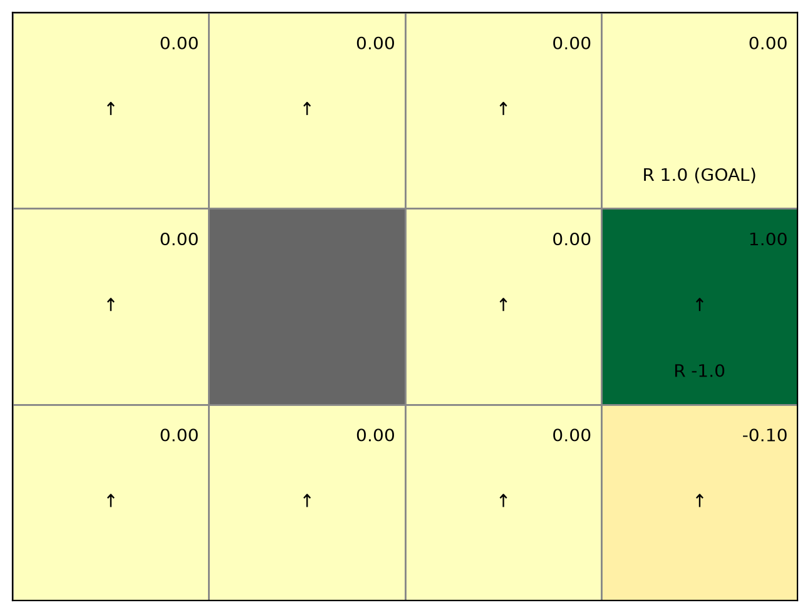
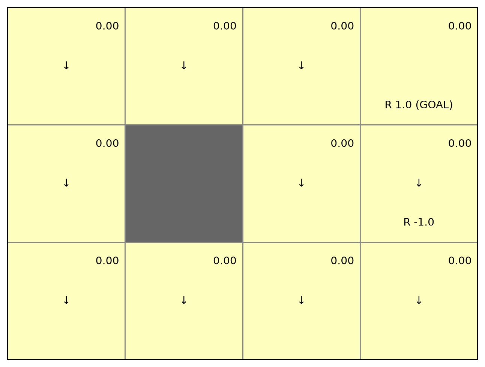
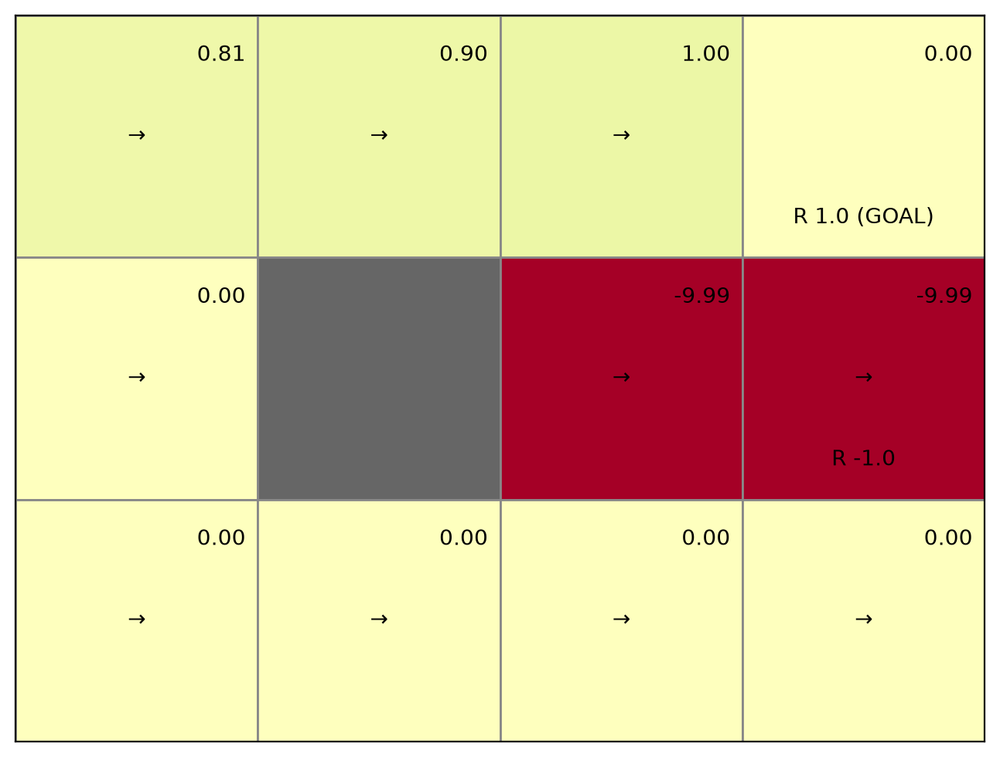
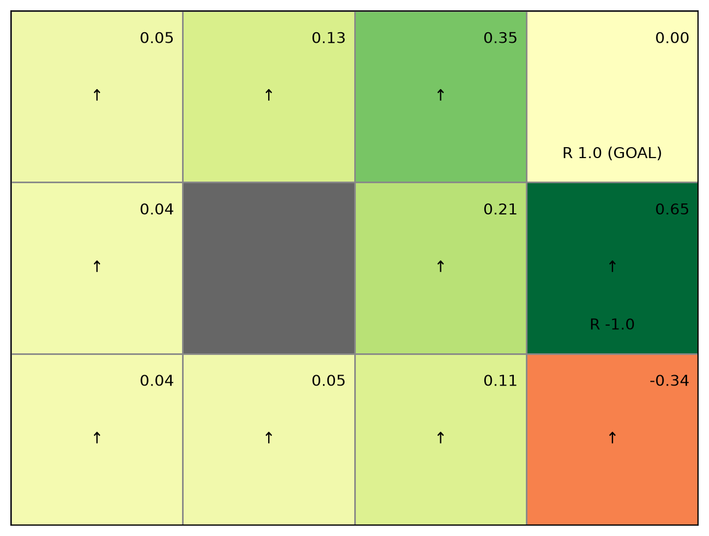

# Week 4 Q1: 정책별 가치 함수 분석

행동 순서는 `[UP, DOWN, LEFT, RIGHT]`이며 할인율은 `γ = 0.9`이다.
목표 `(0, 3)`에 진입하면 보상 `+1`, `(1, 3)`에 진입하거나 머무르면
보상 `-1`을 받는다. 목표 상태의 가치는 `0`으로 고정된다.
벽이나 경계로 이동하려 하면 현재 위치에 머문다.

그래프의 숫자는 각 상태의 기대 할인 보상이다. 초록색은 양수,
빨간색은 음수, 0에 가까운 값은 중립적인 색으로 표시된다.
회색 칸은 벽이고 화살표는 가장 높은 확률의 행동을 나타낸다.
⑤에서는 다른 방향으로도 이동할 수 있지만 가장 확률이 높은 위쪽 화살표만 표시된다.
각 그래프의 색상 범위는 해당 그래프의 가치 크기에 맞춰지므로,
정책 사이의 비교는 색의 진하기보다 숫자를 기준으로 해야 한다.

## ① 위로만 이동: `[1, 0, 0, 0]`



그래프에서 대부분의 칸은 `0`이고, 오른쪽 가운데 칸은 초록색(`1`),
오른쪽 아래 칸은 붉은색(`-0.1`)이다. 위쪽 화살표를 따라가면
오른쪽 열에서만 목표에 도달할 수 있음을 확인할 수 있다.

대부분의 상태에서는 위로 이동하다가 위쪽 경계나 벽에 막혀 머무른다.
목표에 도달하지도, 음수 보상 칸을 방문하지도 않으므로 가치는 `0`이다.
단, `(1, 3)`에서는 바로 목표로 이동하므로 가치가 `1`이다.
`(2, 3)`에서는 먼저 보상 `-1`을 받고 다음 이동에서 `+1`을 받으므로
가치는 `-1 + 0.9 × 1 = -0.1`이다.

시작 상태 `(2, 0)`의 가치는 **0**이다.

## ② 아래로만 이동: `[0, 1, 0, 0]`



그래프의 모든 유효 칸에 `0`이 표시된다. 아래쪽 화살표를 따라가면
아래쪽 경계 또는 벽에 막히며, 위쪽에 있는 목표에 접근할 수 없다.

아래로 이동하다가 아래쪽 경계나 벽에 막혀 머무른다.
목표로 이동할 수 없고, 목표를 제외한 이동 가능한 상태에서는
음수 보상 칸으로 들어갈 일도 없으므로 모든 유효 상태의 가치는 `0`이다.
`(1, 3)`에서 출발해도 아래 칸의 보상은 `0`이므로 가치가 `0`이다.
보상은 출발 칸이 아니라 **이동한 다음 칸**을 기준으로 결정된다.

단, 목표 상태 `(0, 3)`에서 아래로 이동한다고 가정하면 다음 칸은
`(1, 3)`이므로 `-1 + 0.9 × V(1, 3) = -1`이 된다.
하지만 이 과제에서는 목표에 도달하면 종료되므로 목표에서 추가 행동을 하지 않는다.
정책 평가 코드도 목표 상태에서는 아래 계산을 건너뛰고 가치를 `0`으로 고정한다.
따라서 그래프의 `(0, 3)`에는 `-1`이 아니라 **0**이 표시된다.

```python
if state == env.goal_state:
    V[state] = 0
    continue
```

시작 상태 `(2, 0)`의 가치는 **0**이다.

## ③ 왼쪽으로만 이동: `[0, 0, 1, 0]`


그래프의 모든 유효 칸에 `0`이 표시된다. 왼쪽 화살표가 목표의 반대 방향을
가리키므로 목표 보상을 얻지 못한다. ②와 가치값은 같지만 이동 방향은 다르다.

왼쪽으로 이동하다가 왼쪽 경계나 벽에 막혀 머무른다.
목표는 오른쪽에 있으므로 도달할 수 없으며, 음수 보상 칸에도 진입하지 않는다.
따라서 모든 유효 상태의 가치는 `0`이다.

시작 상태 `(2, 0)`의 가치는 **0**이다.

## ④ 오른쪽으로만 이동: `[0, 0, 0, 1]`



맨 위 행에는 목표 쪽으로 갈수록 `0.81 → 0.90 → 1.00`이 표시된다.
가운데 행의 오른쪽 두 칸은 약 `-9.99`로 진한 빨간색이다.
같은 오른쪽 화살표여도 위 행에서는 목표 보상을 받고,
가운데 행에서는 음수 보상이 반복되는 차이가 드러난다.

맨 위 행에서는 목표에 도달할 수 있다. 목표에서 멀어질수록 보상이
더 늦게 발생해 할인되므로 `(0, 2)`, `(0, 1)`, `(0, 0)`의 가치는
각각 `1`, `0.9`, `0.81`이다.

`(1, 2)`에서는 음수 보상 칸 `(1, 3)`에 진입하고, 이후 오른쪽 경계에
막혀 그 칸에 계속 머문다. `(1, 3)`에서 출발해도 같은 일이 발생한다.
매번 보상 `-1`을 받으므로 두 상태의 이론적 가치는
`-1 / (1 - 0.9) = -10`이다. 계산 결과인 약 `-9.9914`는
반복 계산의 종료 임곗값 `0.001`에 따른 근삿값이다.
나머지 유효 상태에서는 보상이 없는 칸에 머물러 가치가 `0`이다.

시작 상태 `(2, 0)`의 가치는 **0**이다.

## ⑤ 위쪽을 선호하는 확률적 정책: `[0.7, 0.1, 0.1, 0.1]`



목표 아래 칸은 약 `0.65`로 가장 강한 초록색이고, 오른쪽 아래 칸은
약 `-0.34`로 빨간색이다. 나머지 유효 칸은 작은 양수 값을 가진다.
①과 같이 위쪽 화살표가 표시되지만, 다른 방향으로 이동할 확률도 있어
왼쪽에 있는 상태에서도 목표 보상의 영향을 받는다.

위쪽 이동 확률이 `70%`이고 나머지 방향은 각각 `10%`이다.
위로만 이동하는 정책과 달리 오른쪽으로도 이동할 수 있어
시작 상태에서 목표에 도달할 가능성이 생긴다.
다만 경계나 벽에 머무르는 일이 잦고 음수 보상 칸을 방문할 수도 있어
시작 상태의 가치는 약 **0.0392**로 작다.

`(1, 3)`에서는 높은 확률로 위쪽 목표에 도달하므로 가치가 약 `0.6458`이다.
반면 `(2, 3)`에서는 높은 확률로 음수 보상 칸에 진입하므로
가치가 약 `-0.3449`이다. 같은 위쪽 선호 정책이어도
각 상태에서 다음에 방문할 칸의 보상에 따라 가치가 달라진다.

## 시작 상태 비교

| 정책 | 시작 상태 `(2, 0)`의 가치 |
| --- | ---: |
| 위로만 이동 | 0 |
| 아래로만 이동 | 0 |
| 왼쪽으로만 이동 | 0 |
| 오른쪽으로만 이동 | 0 |
| 위쪽 선호 확률적 이동 | 약 0.0392 |

다섯 정책 중 시작 상태의 기대 할인 보상이 가장 큰 정책은 ⑤이다.
이는 비교한 다섯 정책 사이의 결과이며, 전체 가능한 정책 중 최적이라는 의미는 아니다.

## 정책에 따라 V가 달라지는 이유

V는 칸에 고정된 보상값이 아니라 **그 칸에서 해당 정책을 따라 앞으로 받을
할인 보상의 기대값**이다. 같은 환경에서도 정책이 바뀌면 이동 경로,
목표까지 걸리는 시간, 음수 보상을 받는 횟수가 달라져 V가 달라진다.

계산은 `V(s) = Σₐ π(a|s)[r(s,a,s′) + 0.9 × V(s′)]`이다.
여기서 r은 이번 행동으로 다음 칸에 들어갈 때 받는 보상이고,
V(s′)은 그 다음 상태에서 앞으로 받을 보상들의 기대값이다.
현재 칸에 적힌 보상을 그대로 더하는 계산은 아니다.

### 같은 상태에서 정책별 가치 비교

아래 값은 코드의 종료 임곗값 0.001로 계산한 근삿값이다.

| 상태 | ① 위 | ② 아래 | ③ 왼쪽 | ④ 오른쪽 | ⑤ 위쪽 선호 |
| --- | ---: | ---: | ---: | ---: | ---: |
| (0,2): 목표 왼쪽 | 0 | 0 | 0 | 1 | 0.3513 |
| (1,2): 음수 보상 칸 왼쪽 | 0 | 0 | 0 | -9.9914 | 0.2085 |
| (1,3): 음수 보상 칸 | 1 | 0 | 0 | -9.9914 | 0.6458 |
| (2,3): 음수 보상 칸 아래 | -0.1 | 0 | 0 | 0 | -0.3449 |
| (2,0): 시작 상태 | 0 | 0 | 0 | 0 | 0.0392 |

### (0,2): 목표로 갈 수 있는 행동의 확률 때문에 변화

④에서는 오른쪽으로 즉시 목표에 들어가므로 `V(0,2) = 1 + 0.9 × 0 = 1`이다.
①에서는 위쪽 경계에 계속 머물러 `V(0,2) = 0 + 0.9 × V(0,2)`가 되고,
이를 만족하는 값은 0이다. ②와 ③도 목표 보상을 얻지 못하므로 0이다.

⑤에서는 오른쪽으로 즉시 목표에 들어갈 확률이 10%이고,
70% 확률로 위쪽 경계에 막혀 머문다. 나머지 행동은 아래 또는 왼쪽으로 이동한다.
따라서 목표 도달이 지연되고 음수 보상을 받을 가능성도 생겨 ④의 1보다 작은
약 0.3513이 된다. 즉시 보상 1에 확률 0.1만 곱한 0.1이 정답은 아니다.
다음 상태에서도 계속 행동하여 나중에 목표에 도달할 가능성을 함께 계산하기 때문이다.

```text
V(0,2) = 0.7 × [0 + 0.9V(0,2)]   # 위: 경계에 머무름
       + 0.1 × [0 + 0.9V(1,2)]   # 아래
       + 0.1 × [0 + 0.9V(0,1)]   # 왼쪽
       + 0.1 × [1 + 0.9 × 0]    # 오른쪽: 목표 도달
```

### (1,2): 음수 보상이 한 번인지 반복되는지에 따라 변화

④에서는 오른쪽으로 음수 보상 칸에 들어간 후 그 칸에 계속 머문다.
매 이동마다 -1을 받아 `V(1,2) = -1 - 0.9 - 0.9² - … = -10`이다.
①은 위로 이동한 뒤 경계에 머물고, ②는 아래로 이동한 뒤 경계에 머물며,
③은 왼쪽 벽에 막혀 머무르므로 모두 보상 0만 받아 V가 0이다.

⑤에서는 음수 보상 칸으로 들어갈 확률이 10% 있지만 위쪽으로 갈 확률은 70%다.
위쪽 행에서 목표로 향할 가능성이 있어 기대값은 약 0.2085로 양수다.
④에서의 반복 손실 경로가 ⑤에서는 목표에 접근할 가능성이 높은 경로로 바뀐다.

### (1,3): 같은 음수 보상 칸에서도 빠져나가는 방향에 따라 변화

①에서는 바로 위의 목표로 이동하여 +1을 받으므로 V가 1이다.
현재 음수 보상 칸에서 출발한다고 해서 -1을 먼저 받는 것은 아니다.
②와 ③에서는 보상 0인 칸으로 빠져나간 뒤 목표에 도달하지 못하므로 V가 0이다.
④에서는 오른쪽 경계에 막혀 음수 보상 칸에 계속 머무르므로 V가 -10에 가깝다.

⑤에서는 70% 확률로 목표에 들어가지만, 10% 확률로 오른쪽 경계에 막혀
현재 칸의 -1을 다시 받으며, 나머지 20%는 아래나 왼쪽으로 이동한다.
그래서 ①의 1보다 낮은 약 0.6458이 된다.

### (2,3): 바로 앞의 손실과 이후 목표 보상의 균형 때문에 변화

①에서는 위로 두 번 이동하여 보상 -1, +1을 차례로 받는다.
따라서 `V(2,3) = -1 + 0.9 × 1 = -0.1`이다.
②와 ④에서는 경계에 머물고, ③에서는 왼쪽으로 이동한 뒤 보상 없는 경계에
머무르므로 V가 0이다.

⑤에서는 70% 확률로 음수 보상 칸으로 이동한다. 그 칸의 가치도 ①의 1에서
약 0.6458로 낮아졌으므로 위쪽 행동의 값은
`-1 + 0.9 × 0.6458 ≈ -0.4188`이다. 아래와 오른쪽 행동은 현재 칸에 머물고,
왼쪽 행동은 다른 칸으로 이동한다. 이 네 값을 확률로 평균하면 약 -0.3449가 되어
①의 -0.1보다 더 낮다. 위쪽 확률을 줄였다고 반드시 가치가 높아지는 것은 아니다.

### (2,0): 목표까지 연결되는 경로가 생겨 변화

①~④는 한 방향만 선택하므로 시작 상태에서 목표까지 이어지는 경로가 없다.
보상 없는 칸에서 이동하거나 머무르므로 V가 모두 0이다.
⑤는 위쪽뿐 아니라 오른쪽도 선택할 수 있어 목표에 도달할 가능성이 생긴다.
다만 목표까지 여러 이동이 필요하고 경계·벽에서 지연되며 음수 보상을 받을 수도 있어
V는 작은 양수인 약 0.0392가 된다.

목표 (0,3)의 V는 어떤 정책에서도 종료 상태 규칙에 따라 0이다.
또한 이 비교는 서로 다른 다섯 정책을 각각 평가한 결과이며,
①에서 ⑤로 정책을 차례로 개선한 과정은 아니다.
