# Week 4 Q2: 5×5 GridWorld 결과 분석

할인율은 0.9, 종료 임곗값은 0.001이다. 좌표는 (행, 열)이며 0부터 시작한다.
시작은 (4, 0), 목표는 (0, 4), 벽은 (2, 1)과 (2, 2)이다.
그림의 폭탄 (0, 3)과 (3, 4)은 진입할 때 -1을 받는 칸으로 해석했다.
Q1과 같이 폭탄은 종료 상태가 아니며, 목표에 도달하면 종료한다.

## 정책 반복

각 step은 현재 정책의 평가가 끝난 시점이다. 그래프의 화살표는
그 가치값을 평가할 때 사용한 정책이며, 다음 step에는 개선한 정책을 사용한다.
정책 평가 내부의 개별 순회는 표시하지 않고, 강의처럼 바깥 반복마다 저장한다.

### step_00

시작 상태 가치: -0.17333

네 방향을 각각 25%로 선택하는 무작위 정책을 평가한 결과다. 폭탄에 진입하거나 머무를 가능성이 있어 목표를 제외한 모든 상태의 가치가 음수다. 시작 상태는 -0.17333이며, 폭탄 아래 (4,4)는 -1.29392로 특히 낮다. 이 가치를 기준으로 다음 정책을 개선한다.

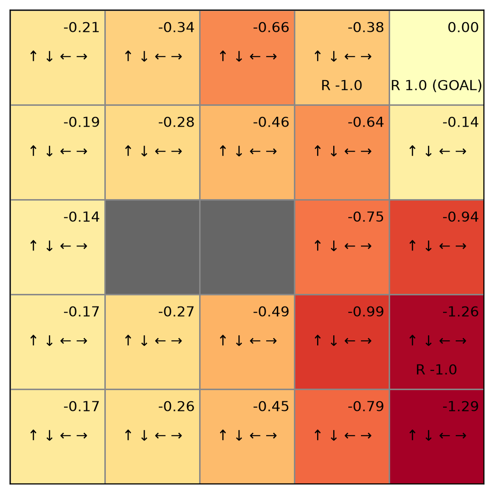

[가치 및 정책 표](policy_iteration/step_00.txt)

### step_01

시작 상태 가치: -0.00677

첫 개선으로 목표 가까이에서는 목표를 향하는 행동이 선택된다. (0,3)과 (1,4)는 1, (1,3)은 0.9가 된다. 하지만 왼쪽에서는 폭탄을 피하는 행동이 벽에 막히거나 목표와 연결되지 않아 가치가 거의 0이다. 시작 상태는 -0.00677까지 개선된다. 작은 음수는 이전 가치에서 출발해 임곗값까지 평가한 근사 오차이며, 보상 없이 계속 머무르는 상태의 정확한 가치는 0이다.

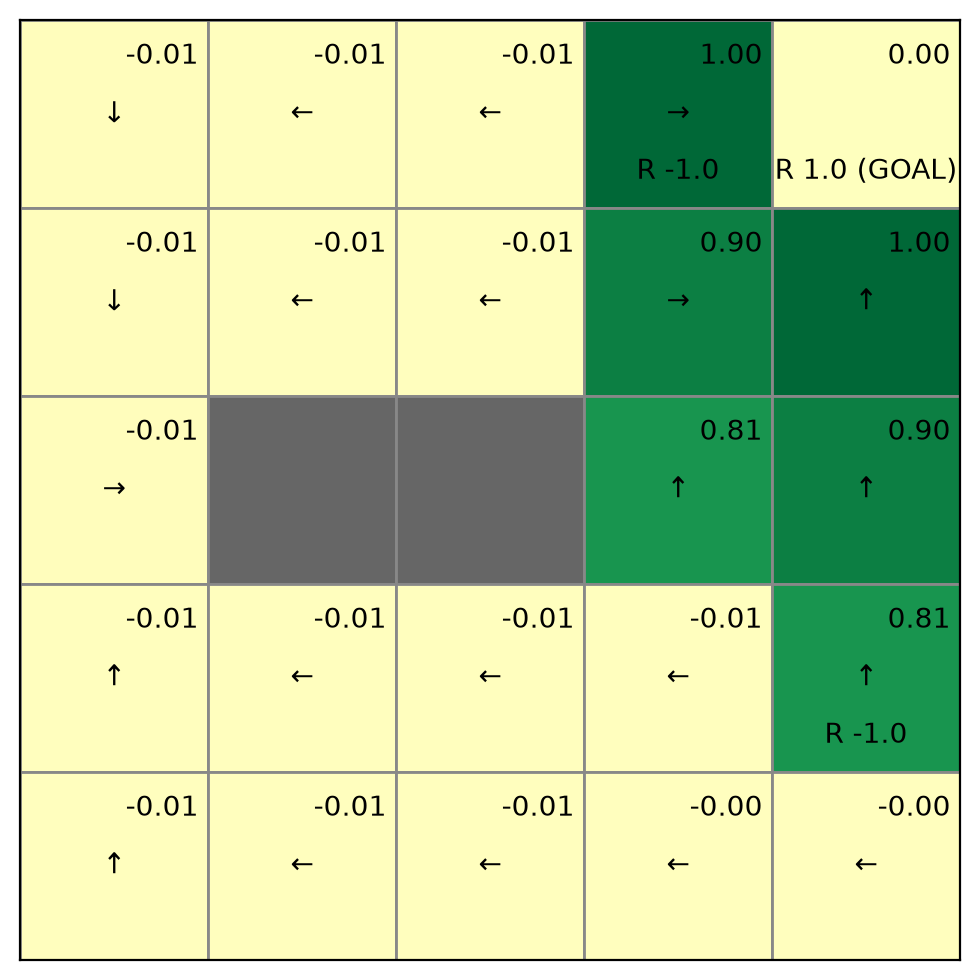

[가치 및 정책 표](policy_iteration/step_01.txt)

### step_02

시작 상태 가치: -0.00236

다음 개선으로 위쪽과 가운데 아래 행에 목표까지 이어지는 경로가 생긴다. (1,2)는 0.81, (3,3)은 0.729로 상승한다. 그러나 맨 아래 행은 오른쪽으로만 이동하다가 (4,4)의 경계에 머무는 정책이므로 아직 목표에 도달하지 못한다. 시작 상태는 약 -0.00236으로 0에 가깝다.

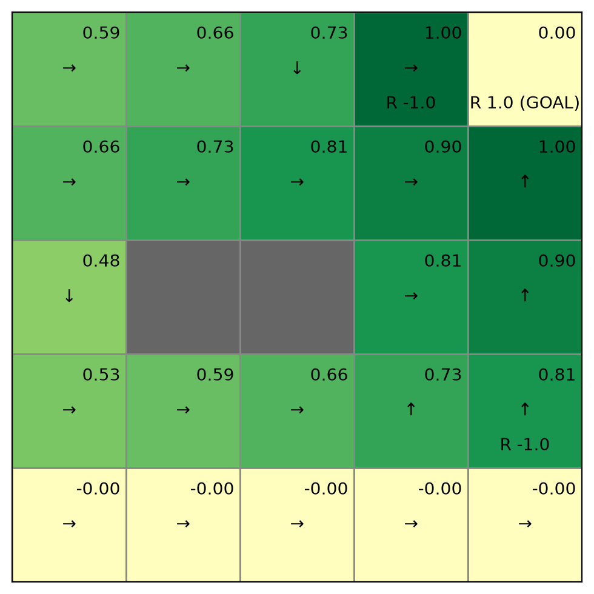

[가치 및 정책 표](policy_iteration/step_02.txt)

### step_03

시작 상태 가치: 0.47830

맨 아래 행의 (4,0)부터 (4,3)까지 화살표가 위쪽으로 바뀌어 목표 경로와 연결된다. 시작 상태 가치는 0.47830이 된다. (2,0)도 아래로 우회하던 경로에서 위로 가는 더 짧은 경로로 바뀌어 0.47830에서 0.59049로 상승한다. 다만 (4,4)는 여전히 오른쪽 경계에 머물러 약 -0.00191이다.

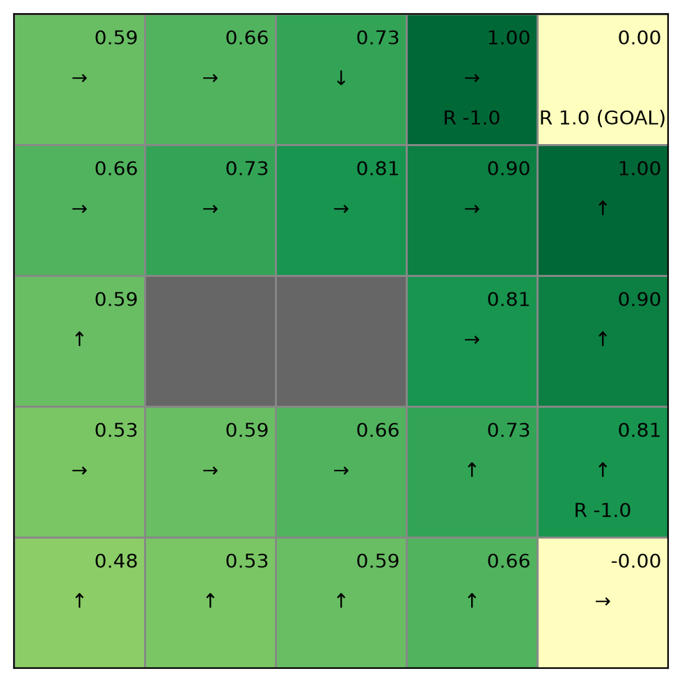

[가치 및 정책 표](policy_iteration/step_03.txt)

### step_04

시작 상태 가치: 0.47830

오른쪽 아래 (4,4)가 왼쪽 이동으로 바뀌어 폭탄을 피해 목표에 도달하며 가치가 0.59049로 상승한다. 아래 행의 일부 칸은 위쪽 대신 오른쪽을 선택하지만 같은 길이의 최적 경로이므로 가치가 변하지 않는다. 개선 후 정책이 현재 정책과 같아져 반복을 종료한다.

[가치 및 정책 표](policy_iteration/step_04.txt)

### final

시작 상태 가치: 0.47830

확정된 정책을 다시 평가한 최종 결과다. step_04와 같은 최적 가치와 정책이며, 시작 상태에서 폭탄을 피하는 8번의 이동으로 목표에 도달한다.

[가치 및 정책 표](policy_iteration/final.txt)

## 가치 반복

step_00은 초기 가치 0이다. 이후 step은 한 번씩 상태 전체를 갱신한 결과다.
초기·중간 그래프에는 정책을 표시하지 않고, 마지막에 탐욕 정책을 표시한다.
강의 코드처럼 같은 딕셔너리를 순서대로 갱신하여 최신 값을 바로 사용한다.

### step_00

시작 상태 가치: 0.00000

모든 상태의 가치를 0으로 초기화한 상태다. 아직 목표 보상이 다른 상태에 반영되지 않았으며 정책도 정하지 않았다.

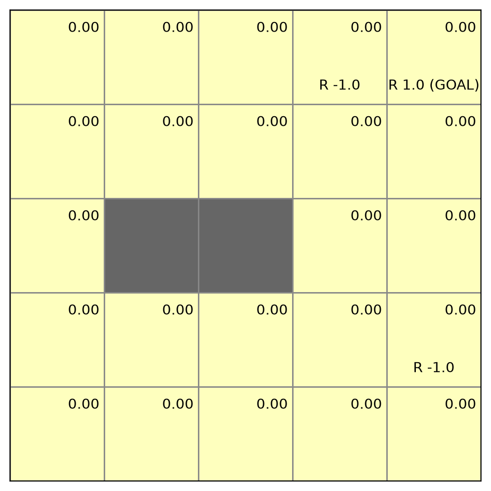

[가치 및 정책 표](value_iteration/step_00.txt)

### step_01

시작 상태 가치: 0.00000

첫 갱신에서 목표로 바로 이동하는 (0,3)과 (1,4)의 가치가 1이 된다. 행 순서대로 갱신하면서 최신 값을 바로 사용하므로 (2,4)는 0.9, (3,4)는 0.81까지 같은 순회에서 갱신된다. 시작 상태는 아직 0이다.

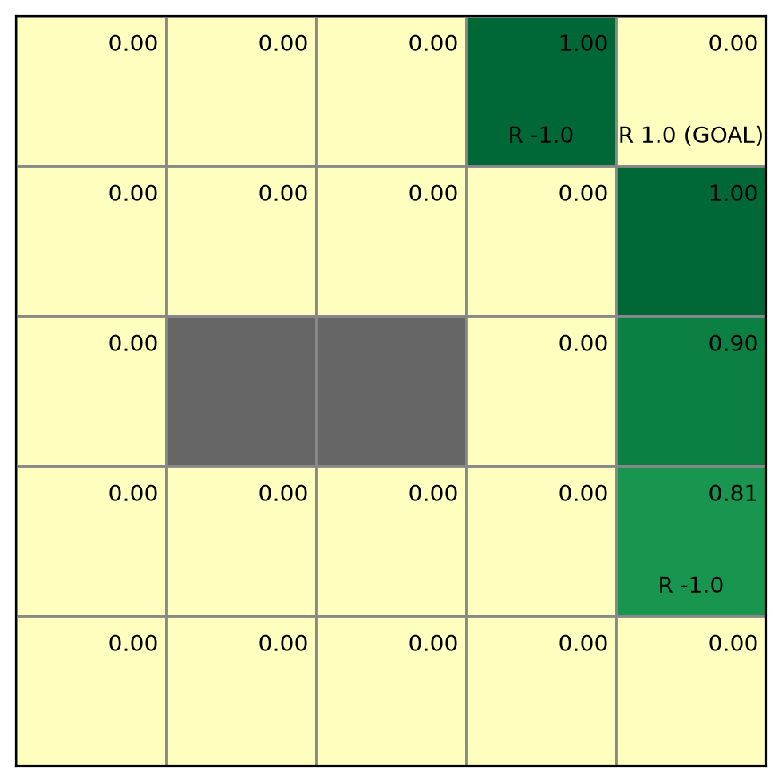

[가치 및 정책 표](value_iteration/step_01.txt)

### step_02

시작 상태 가치: 0.00000

목표 보상이 오른쪽의 3열과 맨 아래 오른쪽으로 전달된다. (1,3)은 0.9, (2,3)은 0.81, (3,3)은 0.729, (4,3)은 0.65610이 된다. (4,4)는 폭탄 위로 이동하는 대신 왼쪽을 선택하는 가치가 반영되어 0.59049가 된다.

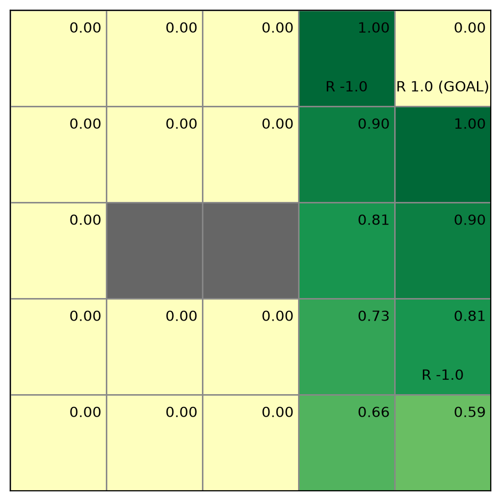

[가치 및 정책 표](value_iteration/step_02.txt)

### step_03

시작 상태 가치: 0.00000

양수 가치가 2열로 확장된다. (1,2)는 0.81, (3,2)는 0.65610, (4,2)는 0.59049가 된다. 두 벽 때문에 보상은 벽을 통과하지 않고 위쪽과 아래쪽 경로를 통해 전달된다.

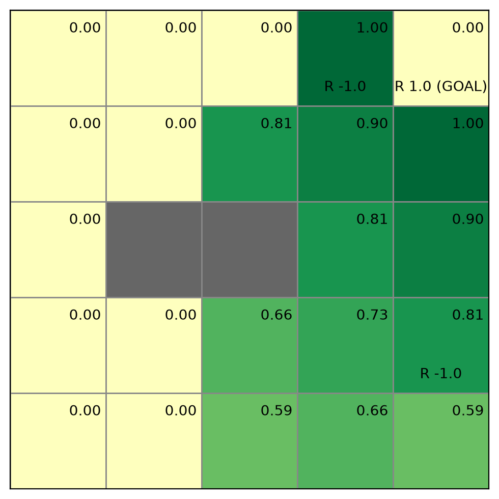

[가치 및 정책 표](value_iteration/step_03.txt)

### step_04

시작 상태 가치: 0.00000

1열에도 목표까지의 가치가 전달된다. (1,1)은 0.729, (3,1)은 0.59049, (4,1)은 0.53144가 된다. (0,2)는 바로 오른쪽 폭탄으로 진입하기보다 아래로 우회하는 가치 0.729를 갖는다.

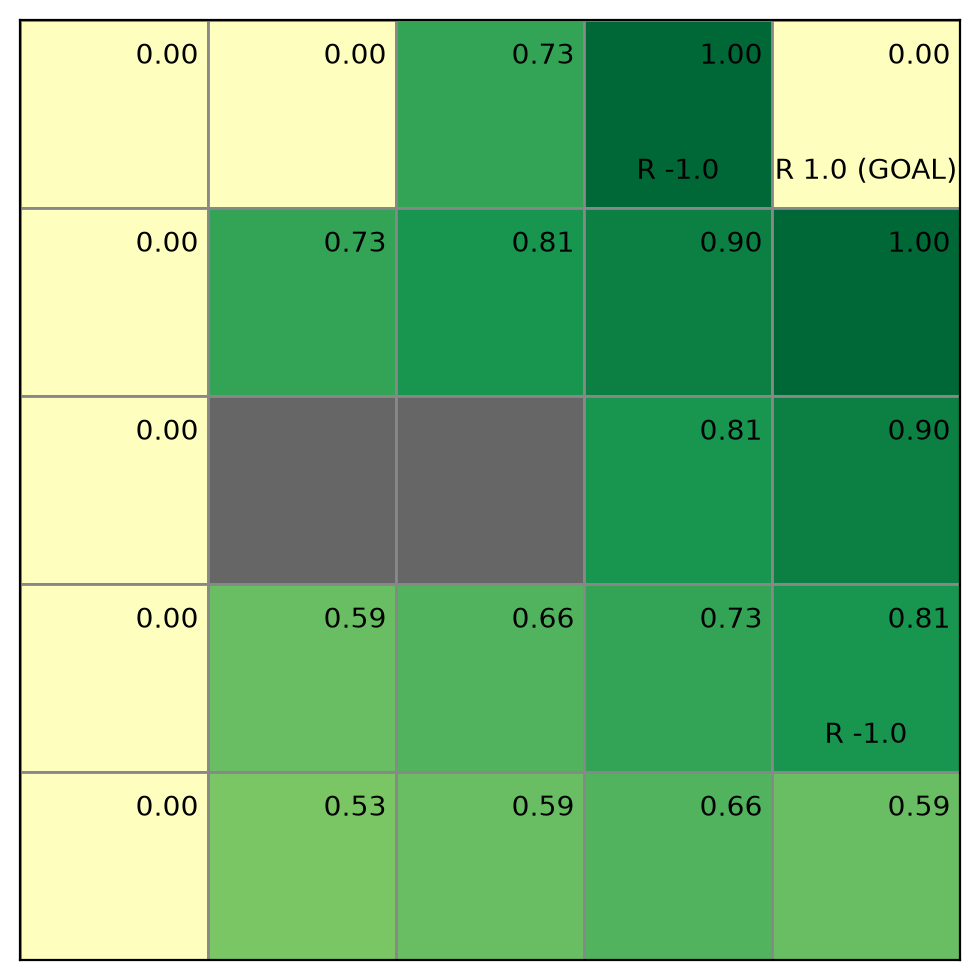

[가치 및 정책 표](value_iteration/step_04.txt)

### step_05

시작 상태 가치: 0.47830

목표 보상이 왼쪽 0열과 시작 상태까지 전달된다. (1,0)은 0.65610, (2,0)은 0.59049, 시작 상태 (4,0)는 0.47830이 된다. 다만 순회 초반에 처리되는 (0,0)은 아직 갱신 전 이웃 값을 사용해 0이다.

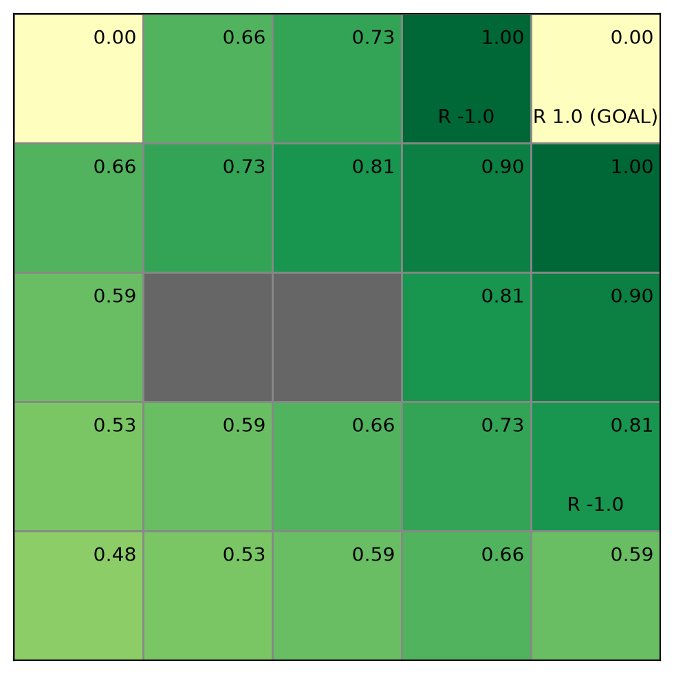

[가치 및 정책 표](value_iteration/step_05.txt)

### step_06

시작 상태 가치: 0.47830

남아 있던 (0,0)이 오른쪽 이웃의 가치를 사용해 0.59049로 바뀐다. 모든 유효 상태의 가치가 최적값에 도달한다. 그다음 한 번 더 갱신하여 변화량이 0임을 확인하고 반복을 종료한다.

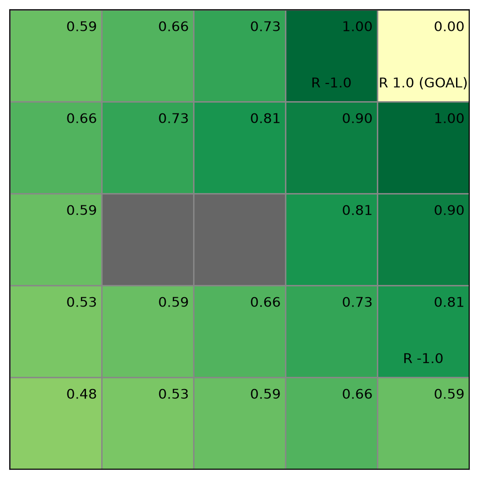

[가치 및 정책 표](value_iteration/step_06.txt)

### final

시작 상태 가치: 0.47830

수렴한 가치에서 각 행동의 보상 + 0.9 × 다음 상태 가치를 비교해 탐욕 정책을 구한다. 여기서 처음으로 화살표를 표시한다. 정책 반복의 최종 결과와 가치·정책이 일치한다.

[가치 및 정책 표](value_iteration/final.txt)

## 정책 반복과 가치 반복의 차이

| 비교 항목 | 정책 반복 | 가치 반복 |
| --- | --- | --- |
| 출발점 | 균등 무작위 정책과 가치 0 | 가치 0 |
| 가치 갱신 | 현재 정책의 행동 확률로 가중 평균 | 행동별 계산값 중 최댓값 선택 |
| 한 단계 | 현재 정책을 임곗값까지 평가한 뒤 개선 | 전체 상태를 한 번 순회해 갱신 |
| 정책 처리 | 각 바깥 반복마다 정책 개선 | 수렴한 가치에서 마지막에 정책 계산 |
| 종료 기준 | 개선 전후 정책이 같음 | 한 순회의 최대 가치 변화가 0.001 미만 |
| 그래프 변화 | 화살표와 가치가 함께 바뀜 | 가치가 전파되고 최종 그래프에 화살표 표시 |

정책 반복은 V(s) = Σₐ π(a|s)[r + 0.9V(s′)]로 현재 정책을 평가한다.
따라서 초기에는 위험한 행동도 평균에 포함되어 음수가 나오고, 정책을 바꾸면서
목표로 연결되는 경로가 늘어난다. 정책 평가 한 단계 안에서 여러 번 전체 상태를 순회한다.

가치 반복은 V(s) = maxₐ[r + 0.9V(s′)]로 매번 가장 좋은 행동의 값을 선택한다.
별도의 정책 평가 수렴을 기다리지 않고 한 순회씩 갱신하므로, 이 결과에서는
목표 주변의 양수 값이 점차 왼쪽으로 확장되는 모습이 나타난다.
초기값이 0이고 각 비목표 상태에 보상 0인 행동이 하나 이상 있어 값이 음수로 내려가지 않는다.

이번 실행에서 정책 반복은 평가·개선 5회를 수행했다. 가치 반복은 전체 상태 갱신 7회를
수행했으며 마지막 순회는 변화가 없음을 확인하는 순회다.
두 방법의 step은 계산량이 다르므로 그래프 개수만으로 속도를 비교할 수 없다.
정책 반복은 한 바깥 단계마다 여러 평가 순회를 수행하고, 가치 반복은 한 단계가 한 순회다.
가치 반복이 항상 더 빠르다는 뜻은 아니며 실제 속도 비교에는 총 순회 수나 실행 시간 측정이 필요하다.

## 최종 결과 비교

정책 반복의 시작 상태 가치: **0.47830**.
가치 반복의 시작 상태 가치: **0.47830**.
두 방법의 상태별 최종 가치 차이의 최댓값은 0.000000이다.

정책 반복은 무작위 정책에서 출발하여 정책 평가와 개선을 반복한다.
가치 반복은 각 상태에서 가장 큰 행동 가치를 선택해 갱신한 뒤 최종 정책을 구한다.
초기에 작은 가치였던 칸도 목표 보상이 전달되면서 양수로 바뀐다.

시작 상태에서는 폭탄을 피하는 8번의 이동으로 목표에 도달할 수 있다.
앞의 7번은 보상 0이고 마지막에 +1을 받으므로 가치는 0.9⁷ ≈ 0.47830이다.
최종 정책의 경로는 (4,0) → (4,1) → (4,2) → (4,3) → (3,3) →
(2,3) → (2,4) → (1,4) → (0,4)이다.

폭탄 칸 자체의 가치도 양수가 될 수 있다. 가치는 현재 칸의 보상이 아니라
그 칸에서 출발하여 앞으로 받을 보상의 합이므로, 폭탄을 벗어나 목표에
도달할 수 있으면 양수가 된다. 폭탄에 진입할 때의 -1은 이전 상태의 행동 가치에 반영된다.

목표 상태의 가치는 종료 상태이므로 0이다. 같은 최대 행동 가치가 여러 개이면
강의의 argmax는 마지막 행동을 선택하므로, 다른 최적 경로도 존재할 수 있다.
각 그래프의 색상 범위는 자동 조정되므로 비교할 때는 숫자를 기준으로 본다.
